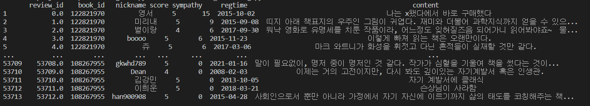
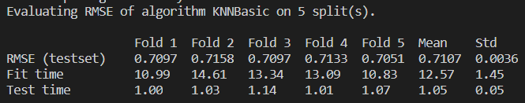

<0308>

아이디어 구체화!
적용할 추천 알고리즘 조사

MBTI별 도서 추천이 가능한지 자료 조사

도서 관련 데이터를 가져오기 위한 자료 조사 (API 사용법 등)

<0309>

Django 설치 및 환경설정
Django 실행 테스트

추천 시스템 알고리즘 학습

<빅데이터 구현부분>
## 크롤링한 리뷰 데이터

## 협업필터링 - KNNBasic 알고리즘 RMSE(Root Mean Square Error)

리뷰 데이터의 양을 늘리고 의미없는 데이터를 삭제하는 등의 데이터 전처리 및 여러 종류의 알고리즘 테스트를 통해 정확도를 향상시켜 나갈 계획입니다.

<0321>
